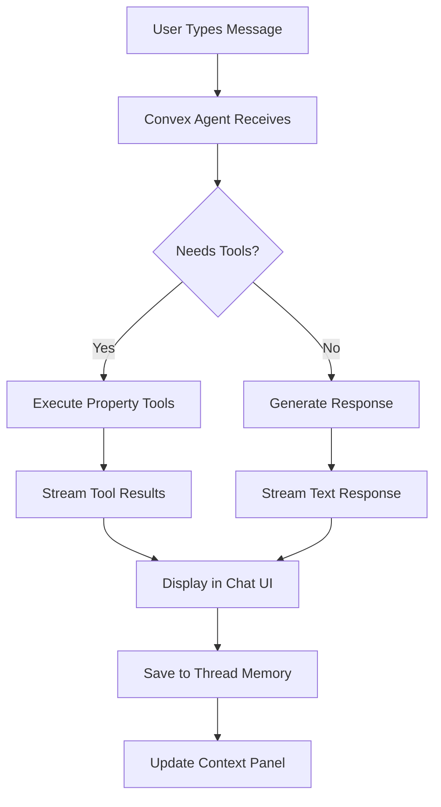

# Minimal AI Chat Starter - Implementation Tasklist

**Objective:** Build an extremely minimal single-page chat experience using Convex, Convex Agent, text-streaming component, memory persistence, and tool use to explore the AI essentials for Transactor 2.0.

**Key Constraint:** Initially, chat threads won't be scoped to users - any time the app loads, all threads will come back.

---

## 📋 THE BRIEF

This minimal AI starter serves as a **proof-of-concept foundation** for Transactor 2.0's AI-driven property concierge platform. The goal is to build a working prototype that demonstrates the core AI capabilities before implementing the full property professional features outlined in the PRD.

### **What We're Building**

A single-page chat application that showcases:

- **Persistent AI Conversations** with memory across sessions
- **Real-time Text Streaming** for responsive user experience
- **Tool Calling** with property-focused utilities
- **Thread Management** with conversation history
- **No User Authentication** initially - all conversations visible to everyone

### **How Everything Works Together**



### **Architecture Overview**

1. **Frontend (Next.js 15 + React 19)**:

   - Single page chat interface with sidebar for thread management
   - Real-time streaming components for live AI responses
   - Tool result display components for interactive outputs

2. **Backend (Convex + AI Components)**:

   - **Convex Agent**: Manages conversation memory and tool orchestration
   - **Persistent Text Streaming**: Handles real-time response streaming
   - **Custom Tools**: Property search, settlement tracking, document generation

3. **AI Integration (OpenAI + Convex)**:
   - GPT-4o-mini for chat responses with property domain knowledge
   - Text embeddings for conversation memory and context retrieval
   - Tool calling for interactive property utilities

### **Why This Foundation Matters**

This minimal implementation will validate:

- **Agent Memory**: How well conversations persist and build context over time
- **Tool Integration**: How seamlessly AI can call property-specific functions
- **Streaming Performance**: How responsive the real-time chat experience feels
- **Scalability Patterns**: How the architecture handles multiple concurrent conversations

Once this foundation works smoothly, we'll extend it with the full Transactor 2.0 features: professional dashboards, settlement tracking, marketplace integration, and revenue protection analytics.

---

## 📚 ESSENTIAL REFERENCES

Keep these Convex documentation links handy during implementation:

### **Core Components**

- **Convex Agent Component**: https://www.convex.dev/components/agent
  - Agent setup, memory management, tool calling patterns
- **Persistent Text Streaming**: https://www.convex.dev/components/persistent-text-streaming
  - Real-time streaming setup, HTTP endpoints, React hooks
- **Convex Workflows**: https://www.convex.dev/components/workflow
  - Durable workflows for complex multi-step processes
- **Convex Workpool**: https://www.convex.dev/components/workpool
  - Background job processing and task queuing

### **Additional Resources**

- **Action Cache Component**: https://www.convex.dev/components/action-cache
  - Caching strategies for external API calls
- **Convex AI Examples**: https://stack.convex.dev/tag/AI
  - Community examples and implementation patterns

### **Quick Reference During Development**

- **Agent API Docs**: Check agent component docs for memory configuration options
- **Streaming Patterns**: Reference streaming component for HTTP endpoint setup
- **Tool Creation**: Use agent docs for `createTool` function signatures
- **Error Handling**: Check workflow docs for retry and error patterns

---

## 🎯 CURRENT STATUS

**✅ Already Completed in Current App:**

- Next.js 15 app with App Router structure
- All required dependencies installed (Convex Agent, Persistent Text Streaming, AI SDK, OpenAI, Zod)
- Convex provider component (`src/components/convex-provider.tsx`)
- Mock chat UI component (`src/components/chat-ui.tsx`) - needs to be connected to real Convex agents
- Tailwind CSS 4 configured with design system
- Basic layout structure with proper fonts and styling
- All Radix UI components available

**🚧 Next Steps:** Start with Phase 1.3 (Convex Configuration) and continue from there.

---

## Phase 1: Foundation Setup

### 1.1 Project Initialization

- [x] ✅ **DONE** - Initialize Next.js app with Convex
- [x] ✅ **DONE** - Project structure set up

### 1.2 Core Dependencies Installation

- [x] ✅ **DONE** - Install Convex Agent component
- [x] ✅ **DONE** - Install Persistent Text Streaming component
- [x] ✅ **DONE** - Install AI SDK and OpenAI

### 1.3 Convex Configuration

- [ ] **START HERE** - Create `convex/convex.config.ts` and configure components:

  ```typescript
  import { defineApp } from "convex/server"
  import agent from "@convex-dev/agent/convex.config"
  import persistentTextStreaming from "@convex-dev/persistent-text-streaming/convex.config"

  const app = defineApp()
  app.use(agent)
  app.use(persistentTextStreaming)
  export default app
  ```

- [ ] Update `src/app/layout.tsx` to include ConvexProvider:

  ```typescript
  import ConvexClientProvider from "@/components/convex-provider"

  export default function RootLayout({ children }: { children: React.ReactNode }) {
    return (
      <html lang="en">
        <body className={`${inter.variable} antialiased`}>
          <ConvexClientProvider>
            <main className="min-h-screen bg-neutral-100">{children}</main>
          </ConvexClientProvider>
        </body>
      </html>
    )
  }
  ```

---

## Phase 2: Backend Implementation

### 2.1 Seed Data Setup (`convex/seedData.ts`)

- [ ] **NEW** - Create comprehensive seed data for realistic tool responses:

  ```typescript
  // convex/seedData.ts
  export const SEED_PROPERTIES = [
    {
      id: "prop_001",
      address: "123 Collins Street, Melbourne VIC 3000",
      type: "apartment",
      bedrooms: 2,
      bathrooms: 2,
      carSpaces: 1,
      price: 850000,
      landSize: null,
      buildingSize: 95,
      yearBuilt: 2018,
      features: ["City views", "Gym", "Concierge", "Rooftop terrace"],
      description:
        "Modern 2-bedroom apartment in the heart of Melbourne CBD with stunning city views.",
      images: ["https://via.placeholder.com/400x300?text=Melbourne+Apartment"],
      listingAgent: "Sarah Chen - Ray White Melbourne",
      inspectionTimes: ["Sat 2:00-2:30 PM", "Wed 6:00-6:30 PM"],
      auctionDate: "2025-02-15",
      priceGuide: "$800,000 - $880,000",
    },
    {
      id: "prop_002",
      address: "45 Ocean Drive, Bondi Beach NSW 2026",
      type: "house",
      bedrooms: 3,
      bathrooms: 2,
      carSpaces: 2,
      price: 2100000,
      landSize: 350,
      buildingSize: 180,
      yearBuilt: 1995,
      features: ["Ocean views", "Renovated kitchen", "Private garden", "Walk to beach"],
      description:
        "Charming 3-bedroom house just 200m from Bondi Beach with ocean glimpses.",
      images: ["https://via.placeholder.com/400x300?text=Bondi+Beach+House"],
      listingAgent: "Michael Torres - LJ Hooker Bondi",
      inspectionTimes: ["Sat 11:00-11:45 AM", "Thu 5:30-6:00 PM"],
      auctionDate: "2025-02-22",
      priceGuide: "$2.0M - $2.2M",
    },
    {
      id: "prop_003",
      address: "78 Chapel Street, South Yarra VIC 3141",
      type: "townhouse",
      bedrooms: 3,
      bathrooms: 2,
      carSpaces: 2,
      price: 1350000,
      landSize: 120,
      buildingSize: 165,
      yearBuilt: 2020,
      features: ["New build", "Private courtyard", "Designer finishes", "Walk to trams"],
      description:
        "Contemporary 3-bedroom townhouse in prestigious South Yarra location.",
      images: ["https://via.placeholder.com/400x300?text=South+Yarra+Townhouse"],
      listingAgent: "Emma Wilson - Marshall White",
      inspectionTimes: ["Sat 1:00-1:30 PM", "Tue 6:00-6:30 PM"],
      auctionDate: null,
      priceGuide: "$1.3M - $1.4M",
    },
    {
      id: "prop_004",
      address: "156 King Street, Newcastle NSW 2300",
      type: "house",
      bedrooms: 4,
      bathrooms: 2,
      carSpaces: 2,
      price: 750000,
      landSize: 580,
      buildingSize: 220,
      yearBuilt: 1960,
      features: [
        "Large block",
        "Original character",
        "Renovation potential",
        "Quiet street",
      ],
      description: "Solid brick home on large block with excellent renovation potential.",
      images: ["https://via.placeholder.com/400x300?text=Newcastle+House"],
      listingAgent: "David Kim - First National Newcastle",
      inspectionTimes: ["Sat 10:00-10:30 AM", "Wed 5:00-5:30 PM"],
      auctionDate: null,
      priceGuide: "$720,000 - $780,000",
    },
  ]

  export const SEED_SETTLEMENTS = [
    {
      id: "settle_001",
      propertyId: "prop_001",
      propertyAddress: "123 Collins Street, Melbourne VIC 3000",
      buyerName: "James & Lisa Thompson",
      sellerName: "Melbourne Property Investments Pty Ltd",
      purchasePrice: 850000,
      contractDate: "2024-12-15",
      settlementDate: "2025-02-14",
      financeApprovalDue: "2025-01-15",
      inspectionDue: "2025-01-08",
      status: "on_track",
      daysToSettlement: 28,
      milestones: [
        { name: "Contract Signed", date: "2024-12-15", status: "completed" },
        { name: "Building & Pest Inspection", date: "2025-01-08", status: "pending" },
        { name: "Finance Approval", date: "2025-01-15", status: "pending" },
        { name: "Final Inspection", date: "2025-02-12", status: "upcoming" },
        { name: "Settlement", date: "2025-02-14", status: "upcoming" },
      ],
      conveyancer: "Sarah Mitchell - Mitchell Legal Services",
      mortgageBroker: "Tom Chen - Premium Finance Solutions",
      riskFactors: [],
    },
    {
      id: "settle_002",
      propertyId: "prop_002",
      propertyAddress: "45 Ocean Drive, Bondi Beach NSW 2026",
      buyerName: "Alexandra Rodriguez",
      sellerName: "The Johnson Family Trust",
      purchasePrice: 2100000,
      contractDate: "2024-11-20",
      settlementDate: "2025-01-25",
      financeApprovalDue: "2024-12-20",
      inspectionDue: "2024-12-01",
      status: "at_risk",
      daysToSettlement: 9,
      milestones: [
        { name: "Contract Signed", date: "2024-11-20", status: "completed" },
        { name: "Building & Pest Inspection", date: "2024-12-01", status: "completed" },
        { name: "Finance Approval", date: "2024-12-20", status: "delayed" },
        { name: "Final Inspection", date: "2025-01-23", status: "upcoming" },
        { name: "Settlement", date: "2025-01-25", status: "at_risk" },
      ],
      conveyancer: "Robert Kim - Eastern Suburbs Conveyancing",
      mortgageBroker: "Lisa Park - Coastal Finance Group",
      riskFactors: [
        "Finance approval delayed",
        "Lender requesting additional documentation",
      ],
    },
    {
      id: "settle_003",
      propertyId: "prop_003",
      propertyAddress: "78 Chapel Street, South Yarra VIC 3141",
      buyerName: "Marcus & Jennifer Wu",
      sellerName: "Prestige Developments Melbourne",
      purchasePrice: 1350000,
      contractDate: "2024-10-30",
      settlementDate: "2025-01-30",
      financeApprovalDue: "2024-11-30",
      inspectionDue: "2024-11-15",
      status: "completed",
      daysToSettlement: 0,
      milestones: [
        { name: "Contract Signed", date: "2024-10-30", status: "completed" },
        { name: "Building & Pest Inspection", date: "2024-11-15", status: "completed" },
        { name: "Finance Approval", date: "2024-11-28", status: "completed" },
        { name: "Final Inspection", date: "2025-01-28", status: "completed" },
        { name: "Settlement", date: "2025-01-30", status: "completed" },
      ],
      conveyancer: "Amanda Foster - Foster & Associates",
      mortgageBroker: "Chris Taylor - Melbourne Mortgage Solutions",
      riskFactors: [],
    },
  ]

  export const SEED_DOCUMENTS = [
    {
      id: "doc_001",
      settlementId: "settle_001",
      type: "contract",
      title: "Contract of Sale - 123 Collins Street",
      description:
        "Standard Victorian contract of sale with special conditions for apartment purchase",
      keyPoints: [
        "30-day settlement period",
        "Subject to finance approval",
        "Building inspection clause included",
        "Vendor to provide Section 32 statement",
      ],
      riskFlags: [],
      complianceStatus: "compliant",
      uploadDate: "2024-12-15",
    },
    {
      id: "doc_002",
      settlementId: "settle_002",
      type: "building_report",
      title: "Building & Pest Inspection - 45 Ocean Drive",
      description: "Comprehensive building and pest inspection report",
      keyPoints: [
        "Minor termite activity detected in rear deck",
        "Roof tiles require maintenance",
        "Electrical system in good condition",
        "Plumbing updated recently",
      ],
      riskFlags: ["Termite treatment recommended within 6 months"],
      complianceStatus: "requires_review",
      uploadDate: "2024-12-01",
    },
    {
      id: "doc_003",
      settlementId: "settle_001",
      type: "finance_approval",
      title: "Loan Pre-Approval - Commonwealth Bank",
      description: "Conditional loan approval subject to valuation",
      keyPoints: [
        "Approved amount: $680,000",
        "Interest rate: 6.24% p.a.",
        "30-year term",
        "Subject to satisfactory valuation",
      ],
      riskFlags: [],
      complianceStatus: "compliant",
      uploadDate: "2025-01-10",
    },
  ]

  export const MARKET_DATA = {
    melbourne_cbd: {
      suburb: "Melbourne CBD",
      postcode: "3000",
      medianPrice: {
        apartment: 650000,
        house: 1200000,
        townhouse: 950000,
      },
      priceGrowth: {
        quarterly: 2.1,
        yearly: 8.5,
        fiveYear: 45.2,
      },
      daysOnMarket: 32,
      auctionClearanceRate: 68,
      rentalYield: 4.2,
      demographics: {
        medianAge: 29,
        medianIncome: 85000,
        populationGrowth: 3.2,
      },
    },
    bondi_beach: {
      suburb: "Bondi Beach",
      postcode: "2026",
      medianPrice: {
        apartment: 1100000,
        house: 2800000,
        townhouse: 1800000,
      },
      priceGrowth: {
        quarterly: 1.8,
        yearly: 12.3,
        fiveYear: 52.1,
      },
      daysOnMarket: 28,
      auctionClearanceRate: 75,
      rentalYield: 3.1,
      demographics: {
        medianAge: 35,
        medianIncome: 95000,
        populationGrowth: 1.8,
      },
    },
  }
  ```

### 2.2 Agent Setup (`convex/agent.ts`)

- [ ] Import required dependencies:

  ```typescript
  import { Agent, createTool } from "@convex-dev/agent"
  import { openai } from "@ai-sdk/openai"
  import { z } from "zod"
  import { components } from "./_generated/api"
  import {
    SEED_PROPERTIES,
    SEED_SETTLEMENTS,
    SEED_DOCUMENTS,
    MARKET_DATA,
  } from "./seedData"
  ```

  📚 **Reference**: https://www.convex.dev/components/agent (Agent Creation section)

- [ ] Create the agent instance:
  ```typescript
  const chatAgent = new Agent(components.agent, {
    chat: openai.chat("gpt-4o-mini"),
    textEmbedding: openai.embedding("text-embedding-3-small"),
    instructions: `You are a helpful property concierge assistant for Australian property professionals and buyers/sellers. 
    
    You have access to real property data, settlement information, and market insights. When users ask about properties, settlements, or market data, use the available tools to provide accurate, specific information from the database.
    
    Key capabilities:
    - Search and analyze real property listings with detailed information
    - Track settlement progress with specific dates and milestones  
    - Generate property-related documents and reports
    - Provide market insights and suburb analysis
    - Help with property investment and purchase decisions
    
    Always provide specific, data-driven responses using the tools available to you.`,
    tools: {
      // Tools will be added in Phase 3
    },
    maxSteps: 5, // Allow tool calls
    contextOptions: {
      includeToolCalls: false,
      recentMessages: 50,
      searchOptions: {
        limit: 5,
        textSearch: false,
        vectorSearch: true,
      },
    },
  })
  ```
  📚 **Reference**: https://www.convex.dev/components/agent (Configuration Options section)

### 2.3 Message Management (`convex/messages.ts`)

- [ ] Create thread creation mutation:

  ```typescript
  export const createThread = mutation({
    args: {},
    handler: async (ctx): Promise<{ threadId: string }> => {
      const { threadId } = await chatAgent.createThread(ctx, {})
      return { threadId }
    },
  })
  ```

  📚 **Reference**: https://www.convex.dev/components/agent (Thread Management section)

- [ ] Create message listing query (no user scoping initially):

  ```typescript
  export const listThreadMessages = query({
    args: {
      threadId: v.string(),
      paginationOpts: paginationOptsValidator,
    },
    handler: async (ctx, { threadId, paginationOpts }) => {
      return await components.agent.listMessages(ctx, {
        threadId,
        paginationOpts,
      })
    },
  })
  ```

- [ ] Create thread listing query (all threads, no user filtering):
  ```typescript
  export const listAllThreads = query({
    args: {
      paginationOpts: paginationOptsValidator,
    },
    handler: async (ctx, { paginationOpts }) => {
      return await ctx.runQuery(components.agent.threads.list, {
        paginationOpts,
      })
    },
  })
  ```

### 2.4 Streaming Text Response (`convex/streaming.ts`)

- [ ] Import Persistent Text Streaming component:

  ```typescript
  import { PersistentTextStreaming } from "@convex-dev/persistent-text-streaming"
  const persistentTextStreaming = new PersistentTextStreaming(
    components.persistentTextStreaming
  )
  ```

  📚 **Reference**: https://www.convex.dev/components/persistent-text-streaming (Setup section)

- [ ] Create stream initialization mutation:

  ```typescript
  export const createChatStream = mutation({
    args: {
      threadId: v.string(),
      prompt: v.string(),
    },
    handler: async (ctx, { threadId, prompt }) => {
      const streamId = await persistentTextStreaming.createStream(ctx)

      // Save user message to thread
      const { thread } = await chatAgent.continueThread(ctx, { threadId })
      const { messageId } = await components.agent.saveMessage(ctx, {
        threadId,
        prompt,
      })

      // Schedule streaming response
      await ctx.scheduler.runAfter(0, internal.streaming.generateStreamingResponse, {
        streamId,
        threadId,
        promptMessageId: messageId,
      })

      return { streamId, messageId }
    },
  })
  ```

  📚 **Reference**: https://www.convex.dev/components/persistent-text-streaming (Stream Creation section)

- [ ] Create HTTP streaming action:

  ```typescript
  export const streamChatResponse = httpAction(async (ctx, request) => {
    const { streamId, threadId } = await request.json();

    const generateResponse = async (ctx, request, streamId, chunkAppender) => {
      const { thread } = await chatAgent.continueThread(ctx, { threadId });

      // Use AI SDK streaming with chunk appender
      const result = await thread.generateText({
        promptMessageId: /* from createChatStream */,
      });

      // Stream chunks as they come
      await chunkAppender(result.text);
    };

    return await persistentTextStreaming.stream(
      ctx,
      request,
      streamId,
      generateResponse
    );
  });
  ```

  📚 **Reference**: https://www.convex.dev/components/persistent-text-streaming (HTTP Streaming section)

- [ ] Expose HTTP endpoint in `convex/http.ts`:

  ```typescript
  import { httpRouter } from "convex/server"
  import { streamChatResponse } from "./streaming"

  const http = httpRouter()
  http.route({
    path: "/stream-chat",
    method: "POST",
    handler: streamChatResponse,
  })

  export default http
  ```

### 2.5 Internal Streaming Action

- [ ] Create internal action for streaming generation:

  ```typescript
  export const generateStreamingResponse = internalAction({
    args: {
      streamId: v.string(),
      threadId: v.string(),
      promptMessageId: v.string(),
    },
    handler: async (ctx, { streamId, threadId, promptMessageId }) => {
      const { thread } = await chatAgent.continueThread(ctx, { threadId })
      const result = await thread.generateText({ promptMessageId })

      // Result is automatically streamed via the HTTP endpoint
      return result.text
    },
  })
  ```

---

## Phase 3: Tool Implementation (With Real Data)

### 3.1 Property Search Tool (Real Data)

- [ ] Create property search tool using real seed data:

  ```typescript
  export const propertySearch = createTool({
    description: "Search for properties based on location, type, price range, and features. Returns real property listings with detailed information.",
    args: z.object({
      location: z.string().optional().describe("Suburb, city, or postcode to search in"),
      propertyType: z.enum(["house", "apartment", "townhouse", "any"]).optional().describe("Type of property"),
      minPrice: z.number().optional().describe("Minimum price in AUD"),
      maxPrice: z.number().optional().describe("Maximum price in AUD"),
      minBedrooms: z.number().optional().describe("Minimum number of bedrooms"),
      features: z.array(z.string()).optional().describe("Desired features like 'ocean views', 'gym', 'parking'")
    }),
    handler: async (ctx, args): Promise<string> => {
      let results = [...SEED_PROPERTIES]

      // Filter by location (fuzzy match on address)
      if (args.location) {
        results = results.filter(prop =>
          prop.address.toLowerCase().includes(args.location!.toLowerCase())
        )
      }

      // Filter by property type
      if (args.propertyType && args.propertyType !== "any") {
        results = results.filter(prop => prop.type === args.propertyType)
      }

      // Filter by price range
      if (args.minPrice) {
        results = results.filter(prop => prop.price >= args.minPrice!)
      }
      if (args.maxPrice) {
        results = results.filter(prop => prop.price <= args.maxPrice!)
      }

      // Filter by bedrooms
      if (args.minBedrooms) {
        results = results.filter(prop => prop.bedrooms >= args.minBedrooms!)
      }

      // Filter by features (partial match)
      if (args.features && args.features.length > 0) {
        results = results.filter(prop =>
          args.features!.some(feature =>
            prop.features.some(propFeature =>
              propFeature.toLowerCase().includes(feature.toLowerCase())
            )
          )
        )
      }

      if (results.length === 0) {
        return "No properties found matching your criteria. Try adjusting your search parameters."
      }

      // Format results
      const formattedResults = results.map(prop => `
  **${prop.address}**
  ```

- Type: ${prop.type} | ${prop.bedrooms} bed, ${prop.bathrooms} bath
- Price: $${prop.price.toLocaleString()} ${prop.priceGuide ? `(Guide: ${prop.priceGuide})` : ''}
- Size: ${prop.buildingSize}m² ${prop.landSize ? `on ${prop.landSize}m² land` : ''}
- Features: ${prop.features.join(', ')}
- Agent: ${prop.listingAgent}
- Inspections: ${prop.inspectionTimes.join(', ')}
${prop.auctionDate ? `- Auction: ${prop.auctionDate}` : ''}

${prop.description}
`).join('\n---\n')

      return `Found ${results.length} propert${results.length === 1 ? 'y' : 'ies'} matching your search:\n\n${formattedResults}`
    },

})

````
📚 **Reference**: https://www.convex.dev/components/agent (Tool Creation section)

### 3.2 Settlement Status Tool (Real Data)
- [ ] Create settlement tracking tool with real settlement data:
```typescript
export const checkSettlementStatus = createTool({
  description: "Check the detailed status of a property settlement including milestones, timeline, and risk factors",
  args: z.object({
    settlementId: z.string().optional().describe("Specific settlement ID to check"),
    propertyAddress: z.string().optional().describe("Property address to find settlement for"),
    buyerName: z.string().optional().describe("Buyer name to find settlement for")
  }),
  handler: async (ctx, args): Promise<string> => {
    let settlement = null

    // Find settlement by ID, address, or buyer name
    if (args.settlementId) {
      settlement = SEED_SETTLEMENTS.find(s => s.id === args.settlementId)
    } else if (args.propertyAddress) {
      settlement = SEED_SETTLEMENTS.find(s =>
        s.propertyAddress.toLowerCase().includes(args.propertyAddress!.toLowerCase())
      )
    } else if (args.buyerName) {
      settlement = SEED_SETTLEMENTS.find(s =>
        s.buyerName.toLowerCase().includes(args.buyerName!.toLowerCase())
      )
    } else {
      // Return all settlements if no specific criteria
      const allSettlements = SEED_SETTLEMENTS.map(s => `
**${s.propertyAddress}** (${s.id})
- Buyer: ${s.buyerName}
- Status: ${s.status.replace('_', ' ').toUpperCase()}
- Settlement Date: ${s.settlementDate}
- Days to Settlement: ${s.daysToSettlement}
      `).join('\n')

      return `All current settlements:\n${allSettlements}\n\nUse a specific settlement ID, property address, or buyer name to get detailed information.`
    }

    if (!settlement) {
      return "Settlement not found. Please check the settlement ID, property address, or buyer name and try again."
    }

    // Format detailed settlement information
    const statusEmoji = {
      'on_track': '✅',
      'at_risk': '⚠️',
      'delayed': '🚨',
      'completed': '🎉'
    }

    const milestoneStatus = settlement.milestones.map(milestone => {
      const statusIcon = {
        'completed': '✅',
        'pending': '⏳',
        'upcoming': '📅',
        'delayed': '🚨',
        'at_risk': '⚠️'
      }
      return `  ${statusIcon[milestone.status] || '📋'} ${milestone.name}: ${milestone.date} (${milestone.status})`
    }).join('\n')

    const riskSection = settlement.riskFactors.length > 0
      ? `\n**Risk Factors:**\n${settlement.riskFactors.map(risk => `⚠️ ${risk}`).join('\n')}`
      : ''

    return `
**Settlement Status Report**
${statusEmoji[settlement.status]} **Status: ${settlement.status.replace('_', ' ').toUpperCase()}**

**Property:** ${settlement.propertyAddress}
**Purchase Price:** $${settlement.purchasePrice.toLocaleString()}
**Settlement Date:** ${settlement.settlementDate}
**Days to Settlement:** ${settlement.daysToSettlement}

**Parties:**
- Buyer: ${settlement.buyerName}
- Seller: ${settlement.sellerName}
- Conveyancer: ${settlement.conveyancer}
- Mortgage Broker: ${settlement.mortgageBroker}

**Milestone Progress:**
${milestoneStatus}
${riskSection}

**Key Dates:**
- Contract Date: ${settlement.contractDate}
- Finance Approval Due: ${settlement.financeApprovalDue}
- Building Inspection Due: ${settlement.inspectionDue}
    `
  },
})
````

### 3.3 Document Analysis Tool (Real Data)

- [ ] Create document analysis tool with real document data:

  ```typescript
  export const analyzeDocument = createTool({
    description: "Analyze property-related documents including contracts, inspection reports, and finance approvals",
    args: z.object({
      documentId: z.string().optional().describe("Specific document ID to analyze"),
      documentType: z.enum(["contract", "building_report", "pest_report", "finance_approval", "all"]).optional().describe("Type of document to find"),
      settlementId: z.string().optional().describe("Settlement ID to find documents for")
    }),
    handler: async (ctx, args): Promise<string> => {
      let documents = [...SEED_DOCUMENTS]

      // Filter documents based on criteria
      if (args.documentId) {
        documents = documents.filter(doc => doc.id === args.documentId)
      }

      if (args.documentType && args.documentType !== "all") {
        documents = documents.filter(doc => doc.type === args.documentType)
      }

      if (args.settlementId) {
        documents = documents.filter(doc => doc.settlementId === args.settlementId)
      }

      if (documents.length === 0) {
        return "No documents found matching your criteria."
      }

      // Format document analysis
      const analysisResults = documents.map(doc => {
        const complianceIcon = {
          'compliant': '✅',
          'requires_review': '⚠️',
          'non_compliant': '🚨'
        }

        const riskSection = doc.riskFlags.length > 0
          ? `\n**Risk Flags:**\n${doc.riskFlags.map(risk => `🚨 ${risk}`).join('\n')}`
          : ''

        return `
  **${doc.title}** (${doc.id})
  ${complianceIcon[doc.complianceStatus]} **Compliance Status:** ${doc.complianceStatus.replace('_', ' ').toUpperCase()}
  ```

**Document Type:** ${doc.type.replace('\_', ' ').toUpperCase()}
**Upload Date:** ${doc.uploadDate}

**Description:** ${doc.description}

**Key Points:**
${doc.keyPoints.map(point => `• ${point}`).join('\n')}
${riskSection}
`
}).join('\n---\n')

      return `Document Analysis Results:\n\n${analysisResults}`
    },

})

````

### 3.4 Market Insights Tool (Real Data)
- [ ] Create market analysis tool with real market data:
```typescript
export const getMarketInsights = createTool({
  description: "Get detailed market insights and trends for specific suburbs including prices, growth rates, and demographics",
  args: z.object({
    suburb: z.string().describe("Suburb name to get market insights for"),
    propertyType: z.enum(["apartment", "house", "townhouse", "all"]).optional().describe("Property type for specific insights")
  }),
  handler: async (ctx, args): Promise<string> => {
    // Normalize suburb name for lookup
    const suburbKey = args.suburb.toLowerCase().replace(/\s+/g, '_')
    const marketData = MARKET_DATA[suburbKey]

    if (!marketData) {
      const availableSuburbs = Object.keys(MARKET_DATA).map(key =>
        key.replace(/_/g, ' ').replace(/\b\w/g, l => l.toUpperCase())
      ).join(', ')

      return `Market data not available for "${args.suburb}". Available suburbs: ${availableSuburbs}`
    }

    // Format market insights
    let priceInfo = ''
    if (args.propertyType && args.propertyType !== 'all') {
      const price = marketData.medianPrice[args.propertyType]
      priceInfo = `**${args.propertyType.toUpperCase()} MEDIAN PRICE:** $${price.toLocaleString()}\n\n`
    } else {
      priceInfo = `**MEDIAN PRICES:**
• Apartments: $${marketData.medianPrice.apartment.toLocaleString()}
• Houses: $${marketData.medianPrice.house.toLocaleString()}
• Townhouses: $${marketData.medianPrice.townhouse.toLocaleString()}

`
    }

    return `
**Market Insights: ${marketData.suburb} (${marketData.postcode})**

${priceInfo}**PRICE GROWTH:**
• Quarterly: ${marketData.priceGrowth.quarterly > 0 ? '+' : ''}${marketData.priceGrowth.quarterly}%
• Yearly: ${marketData.priceGrowth.yearly > 0 ? '+' : ''}${marketData.priceGrowth.yearly}%
• 5-Year: ${marketData.priceGrowth.fiveYear > 0 ? '+' : ''}${marketData.priceGrowth.fiveYear}%

**MARKET ACTIVITY:**
• Days on Market: ${marketData.daysOnMarket} days
• Auction Clearance Rate: ${marketData.auctionClearanceRate}%
• Rental Yield: ${marketData.rentalYield}%

**DEMOGRAPHICS:**
• Median Age: ${marketData.demographics.medianAge} years
• Median Income: $${marketData.demographics.medianIncome.toLocaleString()}
• Population Growth: ${marketData.demographics.populationGrowth > 0 ? '+' : ''}${marketData.demographics.populationGrowth}%

**MARKET SUMMARY:**
${marketData.priceGrowth.yearly > 10 ? '🔥 Strong growth market' : marketData.priceGrowth.yearly > 5 ? '📈 Moderate growth' : '📊 Stable market'} | ${marketData.daysOnMarket < 30 ? '⚡ Fast-moving' : '🐌 Slower sales'} | ${marketData.rentalYield > 4 ? '💰 Good rental returns' : '🏠 Capital growth focused'}
    `
  },
})
````

### 3.5 Update Agent with Real Data Tools

- [ ] Add all tools to agent configuration:
  ```typescript
  const chatAgent = new Agent(components.agent, {
    // ... existing config
    tools: {
      propertySearch,
      checkSettlementStatus,
      analyzeDocument,
      getMarketInsights,
    },
  })
  ```

---

## Phase 4: Frontend Implementation

### 4.1 Core Chat Components

- [ ] Create `useStream` hook from persistent text streaming:

  ```typescript
  // src/hooks/useChat.ts
  import { useStream } from "@convex-dev/persistent-text-streaming/react"
  import { useQuery, useMutation } from "convex/react"
  import { api } from "../../convex/_generated/api"

  export function useChat(threadId: string) {
    const createStream = useMutation(api.streaming.createChatStream)
    const messages = useQuery(api.messages.listThreadMessages, {
      threadId,
      paginationOpts: { cursor: null, numItems: 50 },
    })

    return {
      messages: messages?.results || [],
      createStream,
    }
  }
  ```

### 4.2 Message Components

- [ ] Create `MessageList` component:

  ```typescript
  // src/components/MessageList.tsx
  import { toUIMessages } from "@convex-dev/agent/react";

  export function MessageList({ messages }) {
    const uiMessages = toUIMessages(messages);

    return (
      <div className="flex flex-col space-y-4">
        {uiMessages.map((message) => (
          <div key={message.key} className={`message ${message.role}`}>
            <div className="content">{message.content}</div>
          </div>
        ))}
      </div>
    );
  }
  ```

- [ ] Create `StreamingMessage` component:

  ```typescript
  // src/components/StreamingMessage.tsx
  export function StreamingMessage({ streamId, threadId }) {
    const { text, status } = useStream(
      api.streaming.getChatBody,
      new URL(`${process.env.NEXT_PUBLIC_CONVEX_URL}/stream-chat`),
      true, // driven by this session
      streamId
    );

    return (
      <div className="streaming-message">
        <div className="content">{text}</div>
        {status === "streaming" && <div className="typing-indicator">...</div>}
      </div>
    );
  }
  ```

### 4.3 Main Chat Interface

- [ ] **REPLACE EXISTING** - Update `src/app/page.tsx` to use real Convex agents:

  ```typescript
  // src/app/page.tsx
  "use client"

  import { useState } from "react"
  import { useQuery, useMutation } from "convex/react"
  import { api } from "../../convex/_generated/api"
  import { MessageList } from "@/components/MessageList"
  import { StreamingMessage } from "@/components/StreamingMessage"

  export default function ChatPage() {
    const [currentThreadId, setCurrentThreadId] = useState<string | null>(null)
    const [streamId, setStreamId] = useState<string | null>(null)
    const [inputValue, setInputValue] = useState("")

    const threads = useQuery(api.messages.listAllThreads, {
      paginationOpts: { cursor: null, numItems: 10 }
    })

    const createThread = useMutation(api.messages.createThread)
    const createStream = useMutation(api.streaming.createChatStream)

    const messages = useQuery(
      api.messages.listThreadMessages,
      currentThreadId
        ? {
            threadId: currentThreadId,
            paginationOpts: { cursor: null, numItems: 50 },
          }
        : "skip"
    )

    const handleSendMessage = async () => {
      if (!inputValue.trim()) return

      let threadId = currentThreadId
      if (!threadId) {
        const result = await createThread({})
        threadId = result.threadId
        setCurrentThreadId(threadId)
      }

      const { streamId: newStreamId } = await createStream({
        threadId,
        prompt: inputValue,
      })

      setStreamId(newStreamId)
      setInputValue("")
    }

    return (
      <div className="flex h-screen">
        {/* Sidebar */}
        <div className="w-80 border-r bg-white p-4">
          <h2 className="text-lg font-semibold mb-4">All Conversations</h2>
          <div className="space-y-2">
            {threads?.results?.map((thread) => (
              <button
                key={thread._id}
                onClick={() => setCurrentThreadId(thread._id)}
                className={`w-full text-left p-3 rounded-lg border ${
                  currentThreadId === thread._id
                    ? "bg-blue-50 border-blue-200"
                    : "hover:bg-gray-50"
                }`}
              >
                {thread.title || "New Chat"}
              </button>
            ))}
            <button
              onClick={() => setCurrentThreadId(null)}
              className="w-full text-left p-3 rounded-lg border border-dashed border-gray-300 hover:bg-gray-50"
            >
              + New Conversation
            </button>
          </div>
        </div>

        {/* Main Chat */}
        <div className="flex-1 flex flex-col">
          <div className="flex-1 overflow-y-auto p-6">
            {messages && <MessageList messages={messages.results || []} />}
            {streamId && currentThreadId && (
              <StreamingMessage streamId={streamId} threadId={currentThreadId} />
            )}
          </div>

          {/* Input Area */}
          <div className="border-t p-4">
            <div className="flex gap-3">
              <input
                value={inputValue}
                onChange={(e) => setInputValue(e.target.value)}
                onKeyDown={(e) => e.key === "Enter" && handleSendMessage()}
                placeholder="Ask about property settlements, searches, or documentation..."
                className="flex-1 p-3 border rounded-lg"
              />
              <button
                onClick={handleSendMessage}
                disabled={!inputValue.trim()}
                className="px-6 py-3 bg-blue-600 text-white rounded-lg disabled:opacity-50"
              >
                Send
              </button>
            </div>
          </div>
        </div>
      </div>
    )
  }
  ```

---

## Phase 5: Memory Persistence

### 5.1 Agent Memory Configuration

- [ ] Verify agent memory is working (auto-managed by Agent component):
  ```typescript
  // Memory is automatically handled by the Agent component
  // Messages are stored per-thread with vector embeddings
  // Context retrieval works via contextOptions.searchOptions
  ```

### 5.2 Add Memory Retrieval Query

- [ ] Create memory search function:
  ```typescript
  export const searchMemories = query({
    args: {
      query: v.string(),
      threadId: v.string().optional(),
    },
    handler: async (ctx, { query, threadId }) => {
      return await components.agent.vector.search(ctx, {
        query,
        limit: 5,
        filter: threadId ? { threadId } : {},
      })
    },
  })
  ```

### 5.3 Thread Management

- [ ] Add thread metadata updates:
  ```typescript
  export const updateThread = mutation({
    args: {
      threadId: v.string(),
      title: v.string().optional(),
      summary: v.string().optional(),
    },
    handler: async (ctx, { threadId, title, summary }) => {
      return await ctx.runMutation(components.agent.threads.updateThread, {
        threadId,
        title,
        summary,
      })
    },
  })
  ```

---

## Phase 6: Environment & Testing

### 6.1 Environment Setup

- [ ] Configure environment variables:

  ```bash
  # Add to .env.local
  NEXT_PUBLIC_CONVEX_URL=<convex-deployment-url>
  OPENAI_API_KEY=<openai-api-key>
  ```

- [ ] Set up Convex environment variables in dashboard:
  - `OPENAI_API_KEY`

### 6.2 Basic Testing

- [ ] Test thread creation and message sending
- [ ] Test streaming text responses
- [ ] Test tool calling (property search, settlement status)
- [ ] Test memory retrieval across sessions
- [ ] Test loading all threads (no user scoping)

### 6.3 Error Handling

- [ ] Add error boundaries for React components
- [ ] Add try-catch blocks in mutations/actions
- [ ] Add loading states for streaming
- [ ] Add connection error handling

---

## Phase 7: Basic Styling & Polish

### 7.1 Minimal Styling

- [x] ✅ **DONE** - Basic Tailwind classes available
- [ ] Style message bubbles (user vs assistant)
- [ ] Add typing indicators for streaming
- [ ] Style thread sidebar

### 7.2 Basic UX Improvements

- [ ] Auto-scroll to latest message
- [ ] Clear input after sending
- [ ] Show loading states
- [ ] Add message timestamps

---

## Success Criteria

By completion, you should have:

1. **Working Chat Interface**: Single page with sidebar showing all threads and main chat area
2. **Streaming Responses**: Real-time text streaming from AI with persistence
3. **Tool Usage**: AI can call property-related tools (search, settlement status, docs)
4. **Memory Persistence**: Conversations saved and searchable across sessions
5. **No User Scoping**: All threads visible to anyone who loads the app
6. **Convex Integration**: Fully using Convex Agent and Persistent Text Streaming components

## Key Files Created

```
convex/
  convex.config.ts          ← START HERE
  agent.ts
  messages.ts
  streaming.ts
  http.ts
  _generated/

src/
  app/
    page.tsx                ← REPLACE EXISTING
  components/
    MessageList.tsx         ← NEW
    StreamingMessage.tsx    ← NEW
  hooks/
    useChat.ts             ← NEW
```

This implementation serves as the foundation for exploring how the AI essentials will work in Transactor 2.0, providing hands-on experience with agent memory, tool calling, and real-time streaming before building the full property professional features.
